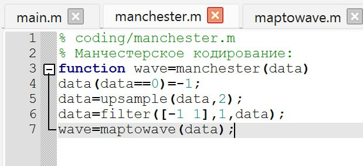
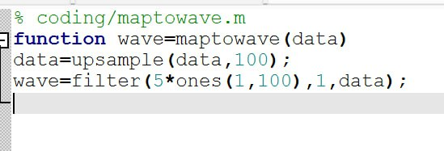
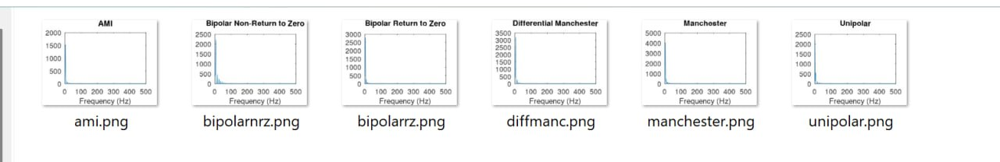

---
## Front matter
title: "Лабораторная работа №1"
subtitle: "Дисциплина: Сетевые технологии"
author: "Жибицкая Евгения Дмитриевна"

## Generic otions
lang: ru-RU
toc-title: "Содержание"

## Bibliography
bibliography: bib/cite.bib
csl: pandoc/csl/gost-r-7-0-5-2008-numeric.csl

## Pdf output format
toc: true # Table of contents
toc-depth: 2
lof: true # List of figures
lot: true # List of tables
fontsize: 12pt
linestretch: 1.5
papersize: a4
documentclass: scrreprt
## I18n polyglossia
polyglossia-lang:
  name: russian
  options:
  - spelling=modern
  - babelshorthands=true
polyglossia-otherlangs:
  name: english
## I18n babel
babel-lang: russian
babel-otherlangs: english
## Fonts
mainfont: IBM Plex Serif
romanfont: IBM Plex Serif
sansfont: IBM Plex Sans
monofont: IBM Plex Mono
mathfont: STIX Two Math
mainfontoptions: Ligatures=Common,Ligatures=TeX,Scale=0.94
romanfontoptions: Ligatures=Common,Ligatures=TeX,Scale=0.94
sansfontoptions: Ligatures=Common,Ligatures=TeX,Scale=MatchLowercase,Scale=0.94
monofontoptions: Scale=MatchLowercase,Scale=0.94,FakeStretch=0.9
mathfontoptions:
## Biblatex
biblatex: true
biblio-style: "gost-numeric"
biblatexoptions:
  - parentracker=true
  - backend=biber
  - hyperref=auto
  - language=auto
  - autolang=other*
  - citestyle=gost-numeric
## Pandoc-crossref LaTeX customization
figureTitle: "Рис."
tableTitle: "Таблица"
listingTitle: "Листинг"
lofTitle: "Список иллюстраций"
lotTitle: "Список таблиц"
lolTitle: "Листинги"
## Misc options
indent: true
header-includes:
  - \usepackage{indentfirst}
  - \usepackage{float} # keep figures where there are in the text
  - \floatplacement{figure}{H} # keep figures where there are in the text
---

# Цель работы

 Знакомство с Octave, получение навыков по работе с ним.
 Изучение методов кодирования и модуляции сигналов с помощью высокоуровнего языка программирования Octave. Определение спектра и параметров
сигнала. Демонстрация принципов модуляции сигнала на примере аналоговой
амплитудной модуляции. Исследование свойства самосинхронизации сигнала

# Выполнение лабораторной работы

Для выполнения работы устанавливаем Octave c помощью Chocolatey(рис. [-@fig:001]).

{#fig:001 width=70%}

Запускаем OCtave GUI, переходим в редактор и создаем новый сценарий plot_sin.m(рис. [-@fig:002]).

{#fig:002 width=70%}

Далее добавляем туда листинг(рис. [-@fig:003])
 и запускаем сценарий, получаем график(рис. [-@fig:004]).

{#fig:003 width=70%}
 
{#fig:004 width=70%}

Сохраняем сценарий, поменяв ему имя, и строим теперь 2 графика - для синуса и косинуса(рис. [-@fig:005]) и (рис. [-@fig:006]).

{#fig:005 width=70%}

{#fig:006 width=70%}

Затем перейдем к разложению импульсного сигнала в частичный ряд Фурье.

Создаем новый сценарий meandr.m, вставляем код(рис. [-@fig:007]). Аналогично пишем через синус, результат получаем тот же (рис. [-@fig:008]).

{#fig:007 width=70%}

{#fig:008 width=70%}

Смотрим на получившийся результат(рис. [-@fig:009]).

{#fig:009 width=70%}

Далее определим пектр и параметры сигнала.

Создаем каталог spectre1 и в нем файл spectre.m(рис. [-@fig:010]).

{#fig:010 width=70%}

Прописываем код и смотрим на результат(рис. [-@fig:011]).

{#fig:011 width=70%}

Дорабатываем код(рис. [-@fig:012]), корректируем график, отбрасывая дублирующие отрицательные частоты и принимая  в расчёт то, что на каждом шаге вычисления быстрого преобразования Фурье происходит суммирование амплитуд сигнало и получаем следующий его вид(рис. [-@fig:013]).

{#fig:012 width=70%}

{#fig:013 width=70%}

Найдем спектр суммы рассмотренных сигналов. Создаем каталог spectr_sum, файл spectre_sum с данным кодом, также полцчаем спектр суммарного сигнала(рис. [-@fig:014]) и (рис. [-@fig:015]).

{#fig:014 width=70%}

{#fig:015 width=70%}

Ознакомимся с амплитудной модуляцией, создадим каталог modulation cо сценарием am.m, увидим, что спектр произведения представляет собой свертку спектров(рис. [-@fig:016])

{#fig:016 width=70%}

Теперь необходимо получить кодированные сигналы для нескольких кодов, проверить свойства самосинхронизуемости кодов по заданной битовой последовательности.

Создаем для работы каталог coding и в нём файлы main.m,
maptowave.m,unipolar.m,ami.m,bipolarnrz.m,bipolarrz.m,manchester.m,
diffmanc.m, calcspectre.m(рис. [-@fig:017])

{#fig:017 width=70%}

Затем убеждаемся, что у нас установлен пакет signal, последовательно добавляем необходимый код в файлы 

В файле main.m подключаем пакет signal и задаем входные кодовые последовательности:
% coding/main.m
% Подключение пакета signal:
pkg load signal;

% Входная кодовая последовательность:
data=[0 1 0 0 1 1 0 0 0 1 1 0];
% Входная кодовая последовательность для проверки
↪️ свойства самосинхронизации:
data_sync=[0 0 0 0 0 0 0 1 1 1 1 1 1 1];
% Входная кодовая последовательность для построения
↪️ спектра сигнала:
data_spectre=[0 1 0 1 0 1 0 1 0 1 0 1 0 1];
% Создание каталогов signal, sync и spectre для
↪️ размещения графиков:
mkdir 'signal';
mkdir 'sync';
mkdir 'spectre';
axis("auto");

Затем в этом же файле пропишем вызовы функций для построения графиков
модуляций кодированных сигналов для кодовой последовательности data:
% Униполярное кодирование
wave=unipolar(data);
plot(wave);
ylim([-1 6]);
title('Unipolar');
print 'signal/unipolar.png';
% Кодирование ami
wave=ami(data);
plot(wave)
title('AMI');
print 'signal/ami.png';
% Кодирование NRZ
wave=bipolarnrz(data);
plot(wave);
title('Bipolar Non-Return to Zero');
print 'signal/bipolarnrz.png';
% Кодирование RZ
wave=bipolarrz(data);
plot(wave)
title('Bipolar Return to Zero');
print 'signal/bipolarrz.png';
% Манчестерское кодирование
wave=manchester(data);
plot(wave)
title('Manchester');
print 'signal/manchester.png';

% Дифференциальное манчестерское кодирование
wave=diffmanc(data);
plot(wave)
title('Differential Manchester');
print 'signal/diffmanc.png';

Затем в этом же файле пропишем вызовы функций для построения графиков модуляций кодированных сигналов для кодовой последовательности
data_sync:
% Униполярное кодирование
wave=unipolar(data_sync);
plot(wave);
ylim([-1 6]);
title('Unipolar');
print 'sync/unipolar.png';
% Кодирование AMI
wave=ami(data_sync);
plot(wave)
title('AMI');
print 'sync/ami.png';
% Кодирование NRZ
wave=bipolarnrz(data_sync);
plot(wave);
title('Bipolar Non-Return to Zero');
print 'sync/bipolarnrz.png';
% Кодирование RZ
wave=bipolarrz(data_sync);
plot(wave)
title('Bipolar Return to Zero');
print 'sync/bipolarrz.png';
% Манчестерское кодирование
wave=manchester(data_sync);
plot(wave)
title('Manchester');
print 'sync/manchester.png';

% Дифференциальное манчестерское кодирование
wave=diffmanc(data_sync);
plot(wave)
title('Differential Manchester');
print 'sync/diffmanc.png';
Далее в этом же файле пропишем вызовы функций для построения графиков
спектров:
% Униполярное кодирование:
wave=unipolar(data_spectre);
spectre=calcspectre(wave);
title('Unipolar');
print 'spectre/unipolar.png';
% Кодирование AMI:
wave=ami(data_spectre);
spectre=calcspectre(wave);
title('AMI');
print 'spectre/ami.png';
% Кодирование NRZ:
wave=bipolarnrz(data_spectre);
spectre=calcspectre(wave);
title('Bipolar Non-Return to Zero');
print 'spectre/bipolarnrz.png';
% Кодирование RZ:
wave=bipolarrz(data_spectre);
spectre=calcspectre(wave);
title('Bipolar Return to Zero');
print 'spectre/bipolarrz.png';
% Манчестерское кодирование:
wave=manchester(data_spectre);
spectre=calcspectre(wave);
title('Manchester');
print 'spectre/manchester.png';
% Дифференциальное манчестерское кодирование:
wave=diffmanc(data_spectre);
spectre=calcspectre(wave);
title('Differential Manchester');
print 'spectre/diffmanc.png';

В остальных файлах прописываем  функции постороения графиков(рис. [-@fig:018]) и (рис. [-@fig:019]).

{#fig:018 width=70%}

{#fig:019 width=70%}

Запускаем главный сценарий и получаем следующие результаты(рис. [-@fig:020]), (рис. [-@fig:021]) и (рис. [-@fig:022]).

{#fig:020 width=70%}

{#fig:021 width=70%}

{#fig:022 width=70%}

# Выводы

В ходе работы было произведено знакомство с Octavе.
 Были также изучены методы кодирования и модуляции сигнала, определены спектры и параметры
сигнала, продемонстрированы принципы модуляции сигнала на примере аналоговой амплитудной модуляции и исследованы свойства самосинхронизации сигнала

# Список литературы{.unnumbered}

[ТУИС](https://esystem.rudn.ru/pluginfile.php/2858347/mod_resource/content/3/001-lab_cod-mod-2.pdf)
