---
## Front matter
title: "Индивидуальный проект. Этап 5"
subtitle: "Дисциплина: Основы информационной безопасности"
author: "Жибицкая Евгения Дмитриевна"

## Generic otions
lang: ru-RU
toc-title: "Содержание"

## Bibliography
bibliography: bib/cite.bib
csl: pandoc/csl/gost-r-7-0-5-2008-numeric.csl

## Pdf output format
toc: true # Table of contents
toc-depth: 2
lof: true # List of figures
lot: true # List of tables
fontsize: 12pt
linestretch: 1.5
papersize: a4
documentclass: scrreprt
## I18n polyglossia
polyglossia-lang:
  name: russian
  options:
	- spelling=modern
	- babelshorthands=true
polyglossia-otherlangs:
  name: english
## I18n babel
babel-lang: russian
babel-otherlangs: english
## Fonts
mainfont: IBM Plex Serif
romanfont: IBM Plex Serif
sansfont: IBM Plex Sans
monofont: IBM Plex Mono
mathfont: STIX Two Math
mainfontoptions: Ligatures=Common,Ligatures=TeX,Scale=0.94
romanfontoptions: Ligatures=Common,Ligatures=TeX,Scale=0.94
sansfontoptions: Ligatures=Common,Ligatures=TeX,Scale=MatchLowercase,Scale=0.94
monofontoptions: Scale=MatchLowercase,Scale=0.94,FakeStretch=0.9
mathfontoptions:
## Biblatex
biblatex: true
biblio-style: "gost-numeric"
biblatexoptions:
  - parentracker=true
  - backend=biber
  - hyperref=auto
  - language=auto
  - autolang=other*
  - citestyle=gost-numeric
## Pandoc-crossref LaTeX customization
figureTitle: "Рис."
tableTitle: "Таблица"
listingTitle: "Листинг"
lofTitle: "Список иллюстраций"
lotTitle: "Список таблиц"
lolTitle: "Листинги"
## Misc options
indent: true
header-includes:
  - \usepackage{indentfirst}
  - \usepackage{float} # keep figures where there are in the text
  - \floatplacement{figure}{H} # keep figures where there are in the text
---

# Цель работы

Завершение выполнения индивидуального проекта. Знакомство и освоение Burp Suite.

# Выполнение лабораторной работы

Запустим сервер для работы с DVWA (рис. [-@fig:001]).

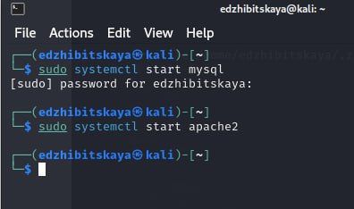{#fig:001 width=70%}

Далее запускаем сам burpsuite.

Burp Suite представляет собой набор мощных инструментов безопасности веб-приложений, которые демонстрируют реальные возможности злоумышленника, проникающего в веб-приложения(рис. [-@fig:002]).

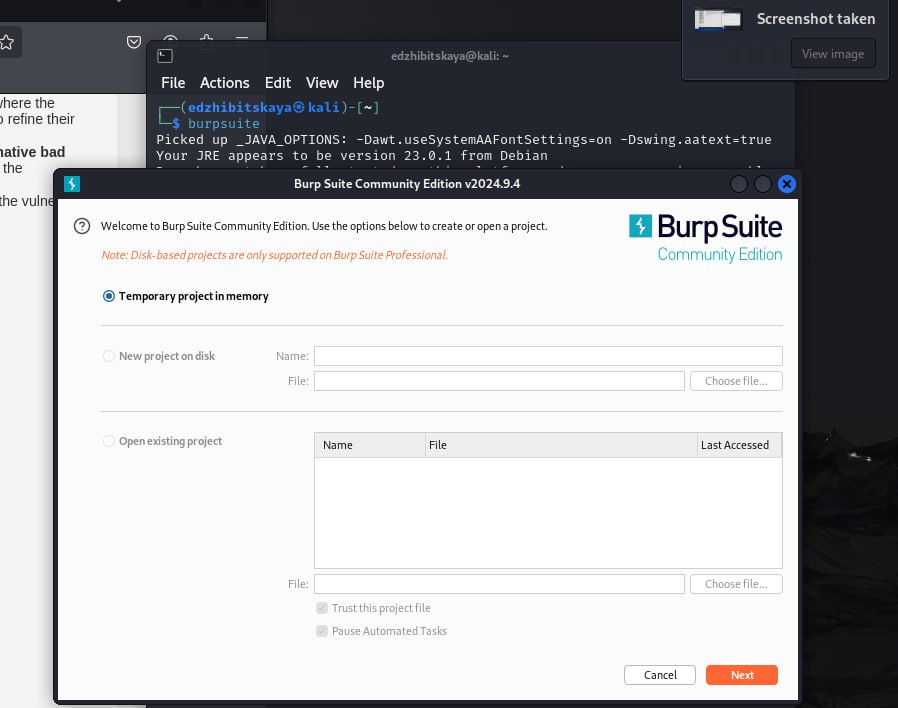{#fig:002 width=70%}

После необходимо его настроить. Для этого в настройках соединения указываем 127.0.0.1 - наш  сервер в http proxy(рис. [-@fig:003]),  проверяем настройки приложения(рис. [-@fig:004]), ставим интерсепт в режим on(рис. [-@fig:005]). 

Также устанавливаем на true параметр network.proxy.allow_hijacking_localhost(рис. [-@fig:006]).

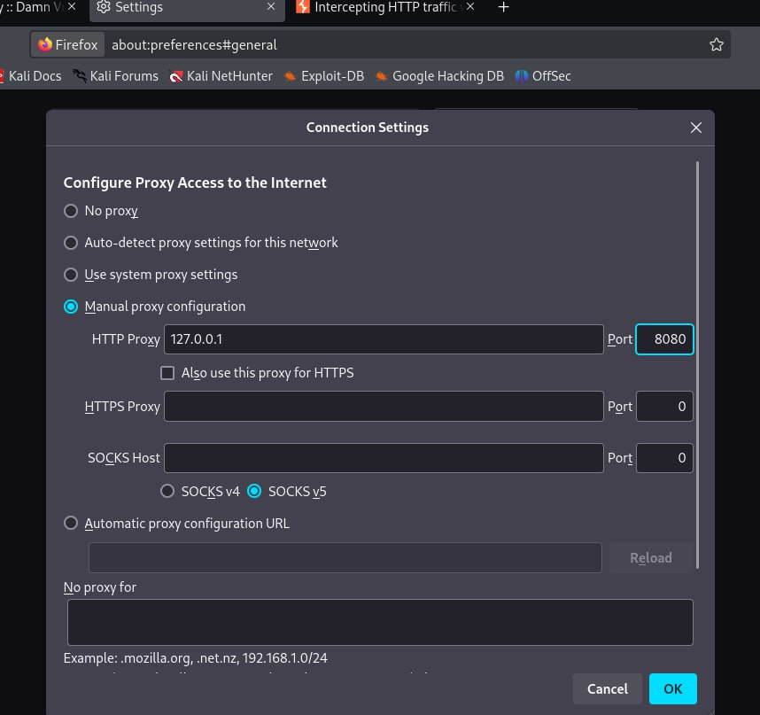{#fig:003 width=70%}

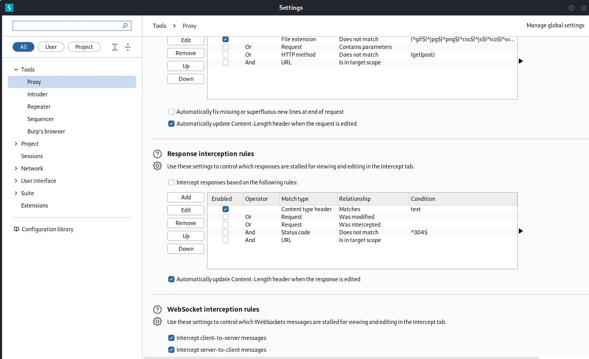{#fig:004 width=70%}

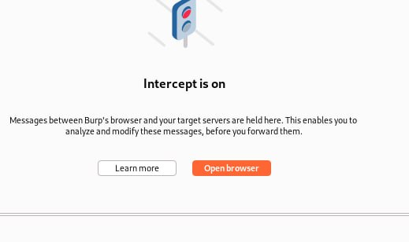{#fig:005 width=70%}

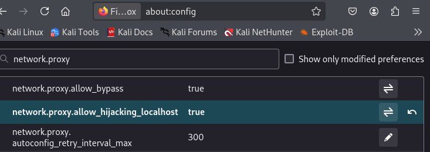{#fig:006 width=70%}

Переходим непосредственно к работе.

Заходим на DVWA и смотрим, что появляется во вкладке Proxy(рис. [-@fig:007]). Видим, что запросы обновляются(также используем forward)(рис. [-@fig:008]).

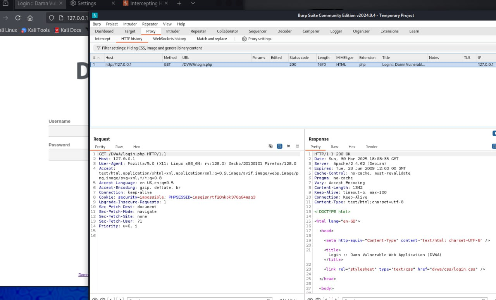{#fig:007 width=70%}

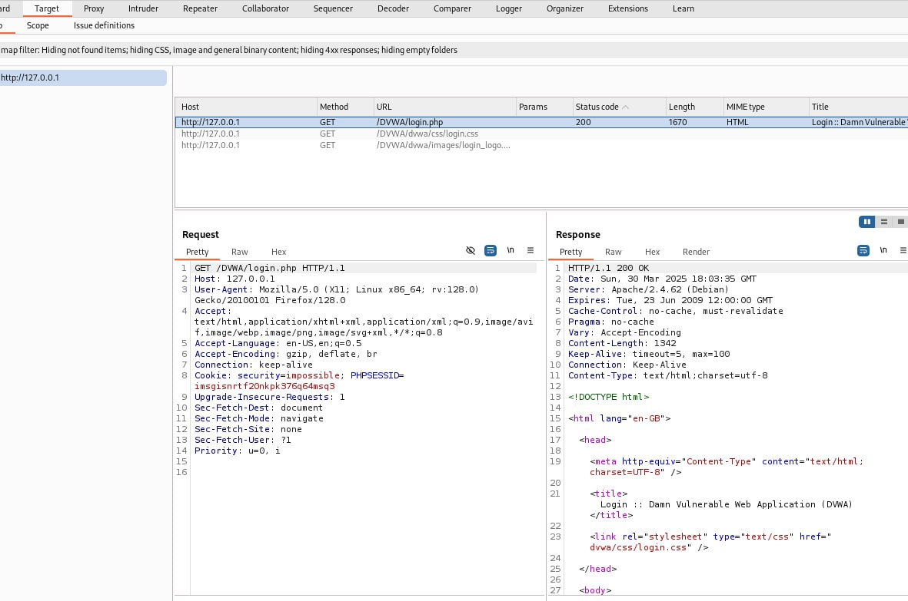{#fig:008 width=70%}

Пытаемся авторизоваться и видим внизу появляются введеные данные(рис. [-@fig:009]).

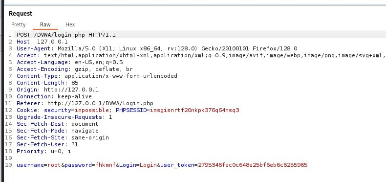{#fig:009 width=70%}

Отправялем запрос в Intruder(рис. [-@fig:010]).

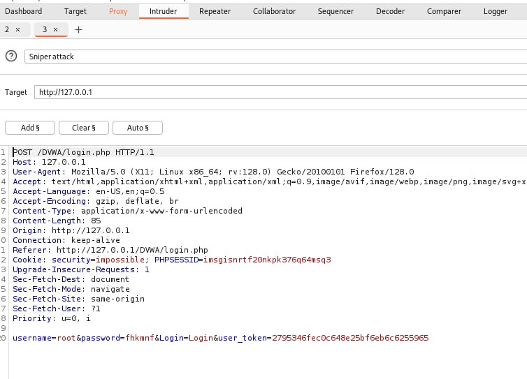{#fig:010 width=70%}

Далее менеям тип атаки на Cluster bomb, меняем(убираем) данные о логине и пароле для дальнейшего подбора(рис. [-@fig:011]).

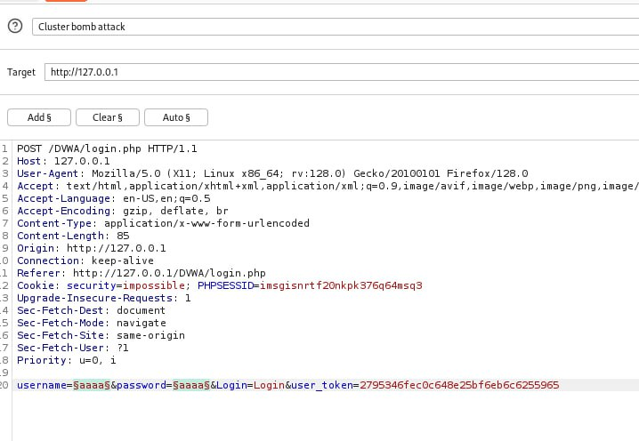{#fig:011 width=70%}

Заполняем данными таблицы 1 и 2 - для логина и пароля(рис. [-@fig:012]) и запускаем атаку(подбор и анализ)(рис. [-@fig:013]).

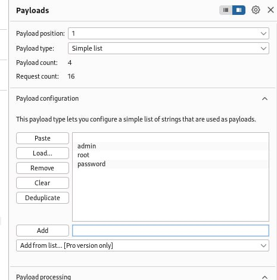{#fig:012 width=70%}
.

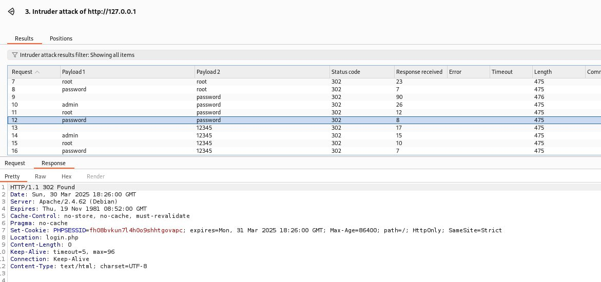{#fig:013 width=70%}

На предыдщем рисунке видно, что местоположение не менятеся при неверных вариантах, а вот если посмотреть ниже, на подходящем наборе данных местоположение(location) уже меняется - происходит авторизация - вход успешный(рис. [-@fig:014]).

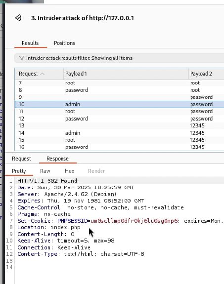{#fig:014 width=70%}

Изучим также работы repeater. Перенаправим туда любой результат, посмотрим на его ответ в виде render - увидим страницу входа(рис. [-@fig:015]).

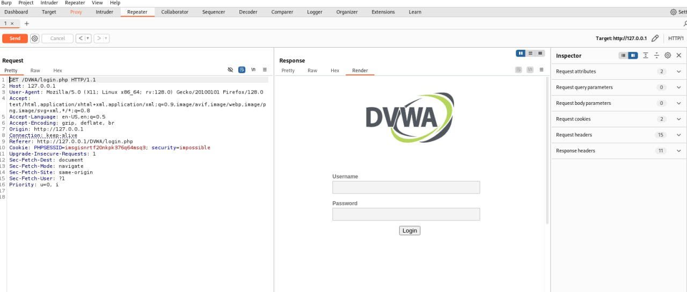{#fig:015 width=70%}

# Выводы

В ходе работы было произведена знакомство с Burp Suite, произведен анализ работы и  принцип атаки подбора данных для входа

# Список литературы{.unnumbered}

- Парасрам, Ш. Kali Linux: Тестирование на проникновение и безопасность : Для профессионалов. Kali Linux / Ш. Парасрам, А. Замм, Т. Хериянто, и др. – Санкт-Петербург : Питер, 2022. – 448 сс.

