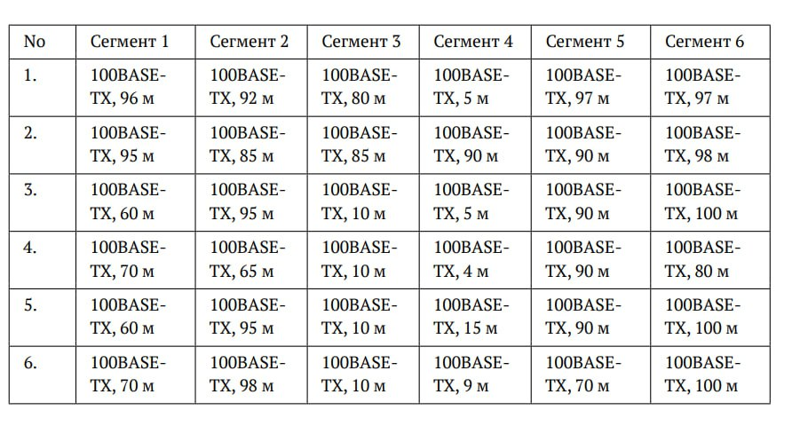
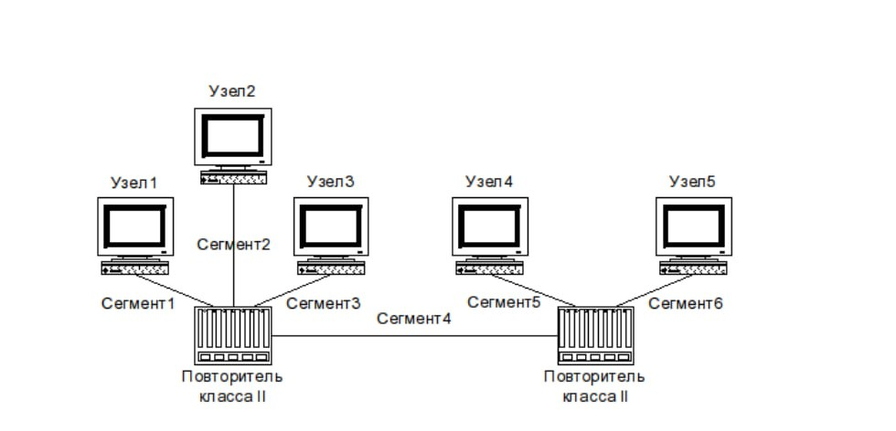
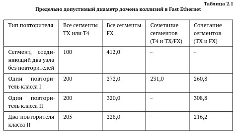
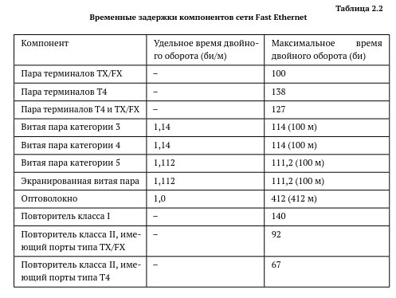

---
## Front matter
lang: ru-RU
title: Лабораторная №2
subtitle: Сетевые технологии
  - Жибицкая Е.Д.
institute:
  - Российский университет дружбы народов, Москва, Россия

## i18n babel
babel-lang: russian
babel-otherlangs: english

## Formatting pdf
toc: false
toc-title: Содержание
slide_level: 2
aspectratio: 169
section-titles: true
theme: metropolis
header-includes:
 - \metroset{progressbar=frametitle,sectionpage=progressbar,numbering=fraction}
---

# Цель

## Цель работы

- Изучение принципов технологий Ethernet и Fast Ethernet. Приобретение навыков оценки работоспособности сети, построенной на базе технологии Fast Ethernet.

# Ход работы 

## Задание

:::::::::::::: {.columns align=center}
::: {.column width="50%"}

Требуется оценить работоспособность 100-мегабитной сети Fast Ethernet в соответствии с первой и второй моделями.

:::
::::::::::::::

## Конфигурация и топология сети

:::::::::::::: {.columns align=center}
::: {.column width="50%"}

:::
::: {.column width="50%"}

:::
::::::::::::::

## Данные

:::::::::::::: {.columns align=center}
::: {.column width="50%"}

Сеть состоит из двух повторителей класса II. Самый длинный путь всегда будет проходить через оба повторителя и соединяющий их сегмент (Сегмент 4). Для расчёта диаметра и PDV нужно найти два самых длинных сегмента, подключённых к разным повторителям.
:::
::: {.column width="50%"}

:::
::::::::::::::

## Формулы

:::::::::::::: {.columns align=center}
::: {.column width="80%"}

- Первая модель:  Длина_Самого_Длинного_Сегмента_на_1м_Повторителе + Длина_Сегмента_4 + Длина_Самого_Длинного_Сегмента_на_2м_Повторителе

- Вторая модель:(Задержка_Сегментов) + (Задержка_Повторителя x 2) + (Задержка_Пары_Терминалов) + (Страховой_Запас) 

*где Задержка_Сегментов = Длина_Сегментов* 1.112

:::
::::::::::::::

## Данные

:::::::::::::: {.columns align=center}
::: {.column width="50%"}

:::
::: {.column width="50%"}

Из конфигурации сети следует, что все сегменты это 100base- TX , также используется 2 повторителя, значит в таблице 2.1 нам подходит последняя строка первого столбца со значением 205 при расчетах 1 способом.

:::
::::::::::::::

## Данные

:::::::::::::: {.columns align=center}
::: {.column width="50%"}

:::
::: {.column width="50%"}

Для расчета вторым способом в таблице  2.2 используем значение удельной задержки 1,112 би/м, так как в нашем случае, исходя из теоретической справки и примера расчетов нам нужна витая пара категории 5, сравниваем со значением 512би.

:::

::::::::::::::

## Расчеты. Вариант 1

* 1 модель: 96+ 5 + 97 = 198м

198м < 205  => конфигурация сети соответствует требованиям 1й модели

* 2 модель: (96+5+97)*1,112 + 92 + 92+ 100 +4 = 508, 176

508.176  < 512  => конфигурация сети соответствует требованиям 2й модели

## Расчеты. Вариант 2

* 1 модель: 95 + 90 + 98 = 283м
283м >  205  => конфигурация сети не  соответствует требованиям 1й модели

* 2 модель: (95 + 90 + 98) * 1,112 +92+92 +100 +4 = 602,696

602,6 >  512  => конфигурация сети не  соответствует требованиям 2й модели

## Расчеты. Вариант 3

* 1 модель:  95 + 5 + 100 = 200м

200 <  205  => конфигурация сети соответствует требованиям 1й модели

* 2 модель: (95 + 5 + 100) * 1,112 + 92 + 92 + 100 + 4 = 510,4

 510,4 < 512  => конфигурация сети  соответствует требованиям 2й модели

## Расчеты. Вариант 4

* 1 модель:  70 + 4 + 90 = 164 м

164 <  205  => конфигурация сети  соответствует требованиям 1й модели

* 2 модель: (70 + 4 + 90) * 1,112 + 92 + 92 + 100 + 4 = 470,368

470,368 < 512  => конфигурация сети  соответствует требованиям 2й модели

## Расчеты. Вариант 5

* 1 модель: 95 + 15 + 100 = 210м

210 >  205  => конфигурация сети не  соответствует требованиям 1й модели

* 2 модель: (95 + 15 + 100) * 1,112 + 92+ 92 + 100 + 4 = 521,52

521,52 >  512  => конфигурация сети не  соответствует требованиям 2й модели

## Расчеты. Вариант 6

* 1 модель: 98 + 9 + 100 = 207м

207 >  205  => конфигурация сети не  соответствует

требованиям 1й модели

* 2 модель: (98 + 9 + 100) * 1,112 +92+92 +100 +4 = 518,184

518,184 >  512  => конфигурация сети не  соответствует требованиям 2й модели

# Выводы

## Вывод

- В ходе работы были изучены принципы технологий Ethernet и Fast Ethernet и приобретены навыки оценки работоспособности сети, построенной на базе технологии Fast Ethernet различными способами

