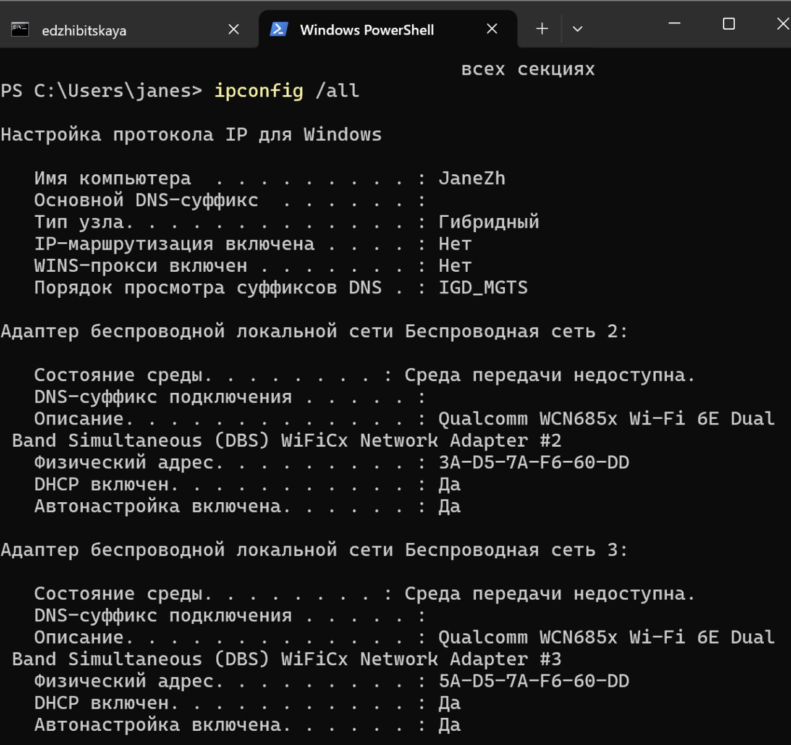
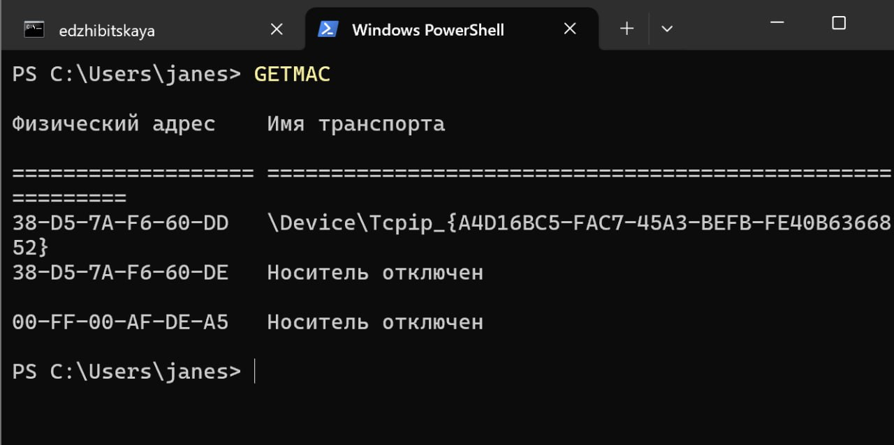
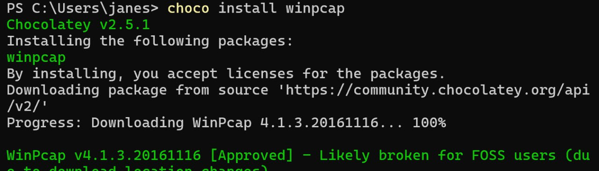
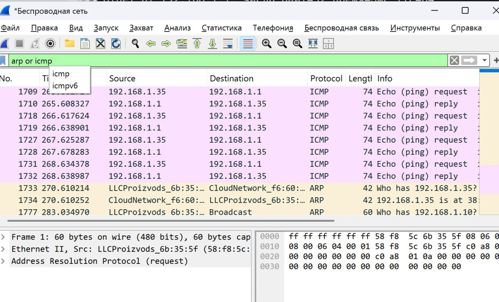
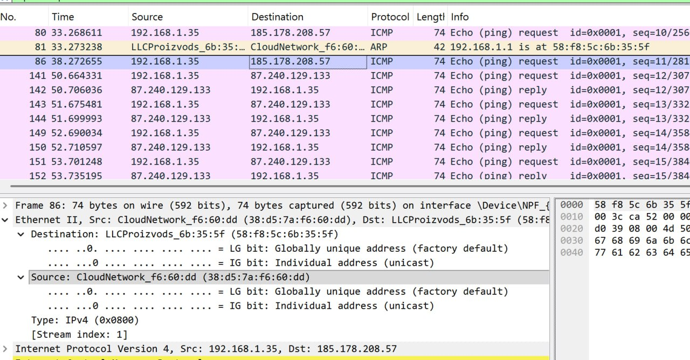
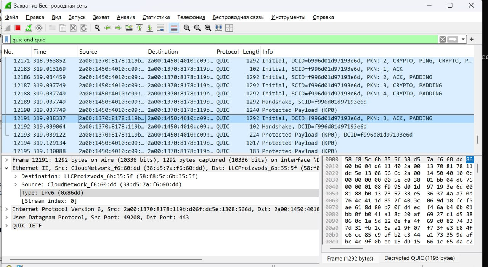
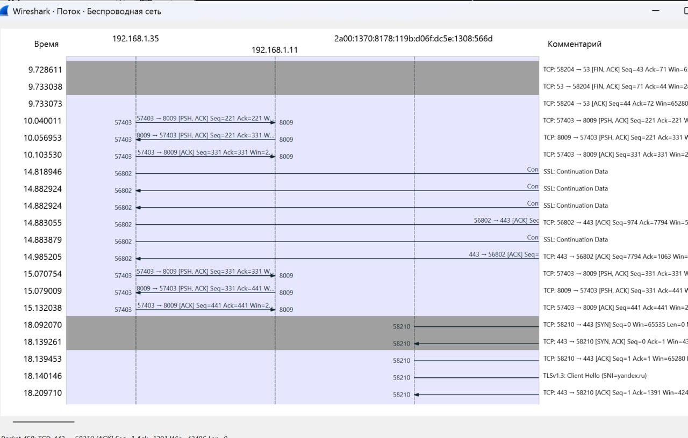

---
## Front matter
lang: ru-RU
title: Лабораторная №3
subtitle: Сетевые технологии
  - Жибицкая Е.Д.
institute:
  - Российский университет дружбы народов, Москва, Россия

## i18n babel
babel-lang: russian
babel-otherlangs: english

## Formatting pdf
toc: false
toc-title: Содержание
slide_level: 2
aspectratio: 169
section-titles: true
theme: metropolis
header-includes:
 - \metroset{progressbar=frametitle,sectionpage=progressbar,numbering=fraction}
---

# Цель

## Цель работы

- Знакомство с Wireshark, изучение с его помощью кадров Ethernet, анализ PDU протоколов транспортного и прикладного уровней стека TCP/IP

# Ход работы 

## Информация об устройстве
:::::::::::::: {.columns align=center}
::: {.column width="40%"}

:::
::: {.column width="50%"}

:::
::::::::::::::

## Информация об устройстве
:::::::::::::: {.columns align=center}
::: {.column width="40%"}

:::
::: {.column width="50%"}

:::
::::::::::::::

## МАС-адрес
:::::::::::::: {.columns align=center}
::: {.column width="50%"}

 MAC-адрес 38-D5-7A-F6-60-DD

:::
::: {.column width="50%"}

OUI (идентификатор производителя): 38-D5-7A

Идентификатор сетевого интерфейса(уникальная часть: F6-60-DD

Тип адреса:

Индивидуальный (Unicast): Младший бит первого байта (38 -> 00111000) равен 0.

Глобально администрируемый (UAA): Второй младший бит первого байта равен 0.
:::
::::::::::::::

##  Установка пакетов
:::::::::::::: {.columns align=center}
::: {.column width="50%"}

:::
::: {.column width="50%"}

:::
::::::::::::::

## Wireshark
:::::::::::::: {.columns align=center}
::: {.column width="50%"}

Далее запускаем Wireshark,  выбираем активный на устройстве интерфейс и смотрим, что начался захват трафика
:::
::: {.column width="50%"}

:::
::::::::::::::

## Определение данных
:::::::::::::: {.columns align=center}
::: {.column width="50%"}

:::
::: {.column width="50%"}

Далее командой  ipconfig определим IP-адрес
устройства и шлюз по умолчанию
:::
::::::::::::::

## Пакеты
:::::::::::::: {.columns align=center}
::: {.column width="50%"}

:::
::: {.column width="50%"}

:::
::::::::::::::

## Эхо-запрос и эхо-ответ ICMP 
:::::::::::::: {.columns align=center}
::: {.column width="50%"}

:::
::: {.column width="50%"}

:::
::::::::::::::

## Протокол ARP
:::::::::::::: {.columns align=center}
::: {.column width="60%"}

:::
::::::::::::::

## Просмотр данных
:::::::::::::: {.columns align=center}
::: {.column width="50%"}

Начнем новый процесс захвата и пропингуем любой другой адрес, например, VK

При обмене пакетами с внешними сетями  MAC-адреса источника и назначения в кадре Ethernet всегда принадлежат устройствам локальной сети (отправителю и шлюзу).
:::
::::::::::::::

## Просмотр данных
:::::::::::::: {.columns align=center}
::: {.column width="50%"}

:::
::: {.column width="50%"}

:::
::::::::::::::

## Анализ протоколов транспортного уровня
:::::::::::::: {.columns align=center}
::: {.column width="60%"}
Можно увидеть, что используются tcp протоколы, сетевые протоколы ipv4/6 В качестве DNS-сервера используется маршрутизатор (fe80::5af8:5cff:fe60:355f), который ретранслирует запросы на внешние DNS-серверы и возвращает ответы. Запросы отправляются на Microsoft-серверы.

Для QUIC запросов используется UDP протокол, ipv6, видны типы пактов - initial(c основными данными), handshake.
:::
::: {.column width="40%"}

{#fig:016 width=70%}
:::
::::::::::::::

## Анализ протоколов транспортного уровня
:::::::::::::: {.columns align=center}
::: {.column width="50%"}

:::
::: {.column width="50%"}

:::
::::::::::::::

## Handshake
:::::::::::::: {.columns align=center}
::: {.column width="45%"}

:::
::: {.column width="50%"}
TCP Handshake (3-way):

Клиент → Сервер: SYN (запрос на соединение)

Сервер → Клиент: SYN-ACK (подтверждение + свой запрос)

Клиент → Сервер: ACK (подтверждение). Соединение установлено.
:::
::::::::::::::

## График потока
:::::::::::::: {.columns align=center}
::: {.column width="50%"}

Далее просмотрим график потока в меню статистика и ознакомимся с информацией. Остановим захват.
:::
::: {.column width="50%"}

:::
::::::::::::::

# Вывод

## Выводы

- В ходе работы было произведено знакомство с Wireshark, были изучены  с его помощью кадры Ethernet, произведенр анализ PDU протоколов транспортного и прикладного уровней стека TCP/IP

