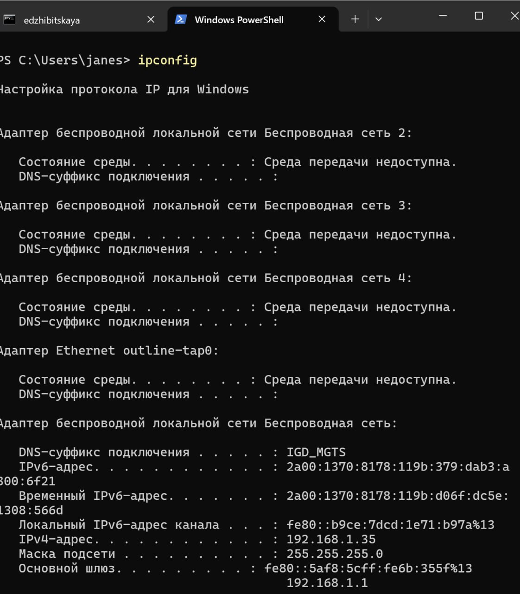
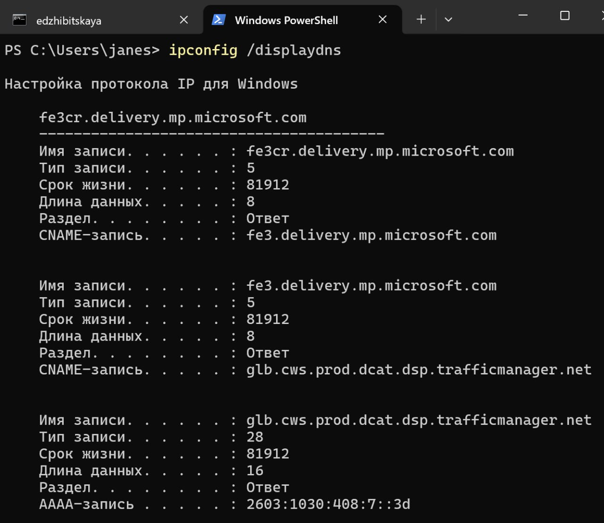
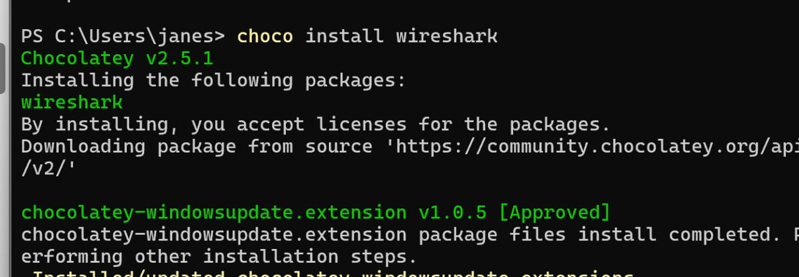
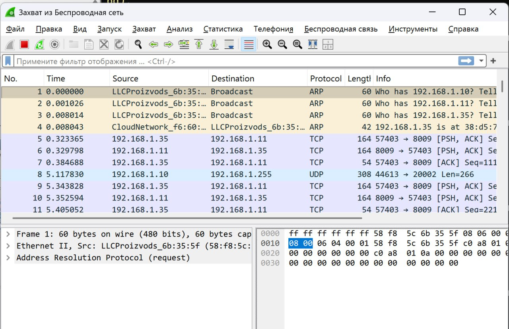
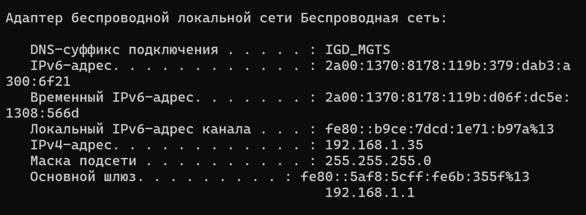
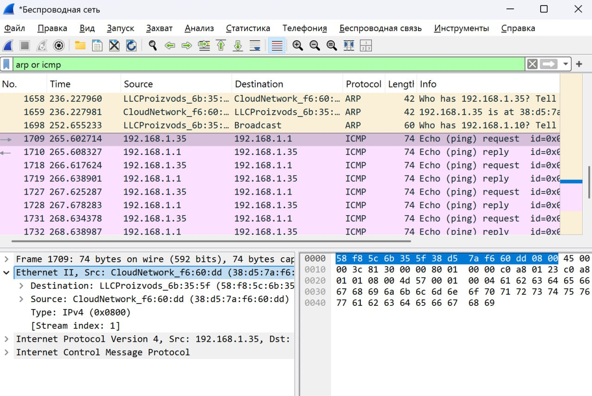
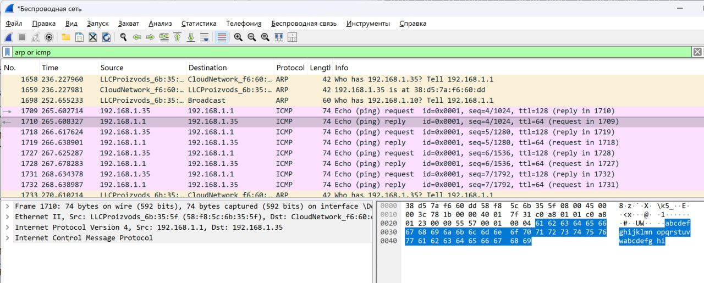
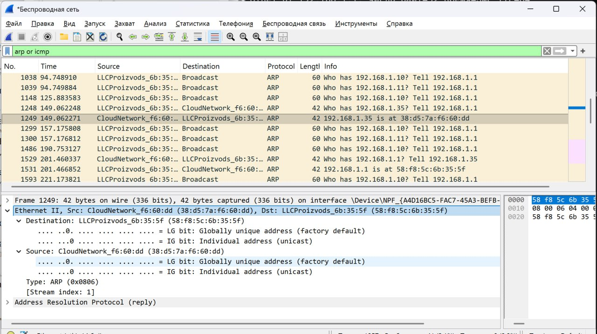
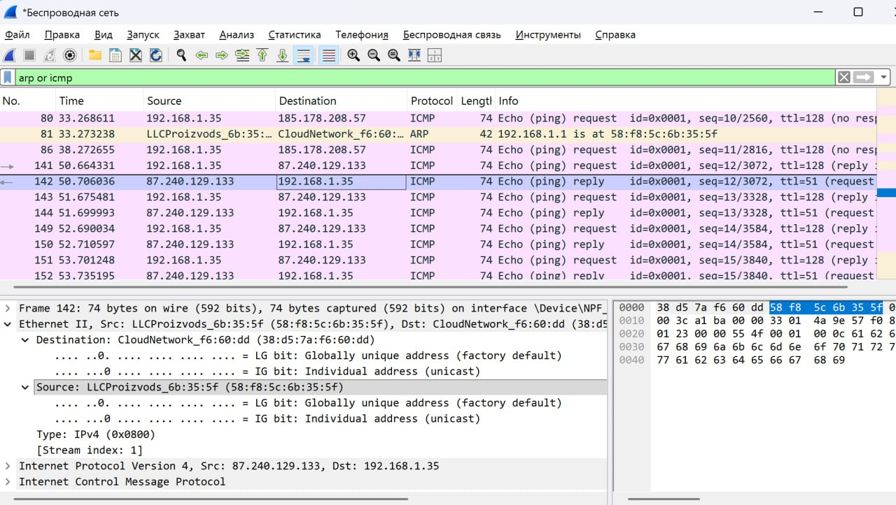
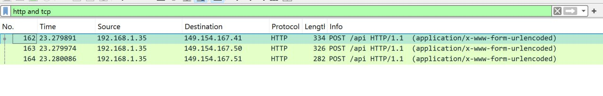

---
## Front matter
title: "Лабораторная работа №3"
subtitle: "Дисциплина: Сетевые технологии"
author: "Жибицкая Евгения Дмитриевна"

## Generic otions
lang: ru-RU
toc-title: "Содержание"

## Bibliography
bibliography: bib/cite.bib
csl: pandoc/csl/gost-r-7-0-5-2008-numeric.csl

## Pdf output format
toc: true # Table of contents
toc-depth: 2
lof: true # List of figures
lot: true # List of tables
fontsize: 12pt
linestretch: 1.5
papersize: a4
documentclass: scrreprt
## I18n polyglossia
polyglossia-lang:
  name: russian
  options:
	- spelling=modern
	- babelshorthands=true
polyglossia-otherlangs:
  name: english
## I18n babel
babel-lang: russian
babel-otherlangs: english
## Fonts
mainfont: IBM Plex Serif
romanfont: IBM Plex Serif
sansfont: IBM Plex Sans
monofont: IBM Plex Mono
mathfont: STIX Two Math
mainfontoptions: Ligatures=Common,Ligatures=TeX,Scale=0.94
romanfontoptions: Ligatures=Common,Ligatures=TeX,Scale=0.94
sansfontoptions: Ligatures=Common,Ligatures=TeX,Scale=MatchLowercase,Scale=0.94
monofontoptions: Scale=MatchLowercase,Scale=0.94,FakeStretch=0.9
mathfontoptions:
## Biblatex
biblatex: true
biblio-style: "gost-numeric"
biblatexoptions:
  - parentracker=true
  - backend=biber
  - hyperref=auto
  - language=auto
  - autolang=other*
  - citestyle=gost-numeric
## Pandoc-crossref LaTeX customization
figureTitle: "Рис."
tableTitle: "Таблица"
listingTitle: "Листинг"
lofTitle: "Список иллюстраций"
lotTitle: "Список таблиц"
lolTitle: "Листинги"
## Misc options
indent: true
header-includes:
  - \usepackage{indentfirst}
  - \usepackage{float} # keep figures where there are in the text
  - \floatplacement{figure}{H} # keep figures where there are in the text
---

# Цель работы

Знакомство с Wireshark, изучение с его помощью кадров Ethernet, анализ PDU протоколов транспортного и прикладного уровней стека TCP/IP

# Выполнение лабораторной работы

Для начала введем ipconfig, получив информацию об устройстве, воспользуемся опциями для более подробного вывода(рис. [-@fig:001] и (рис. [-@fig:002]) и (рис. [-@fig:003]))   узнаем  MAC-адрес устройства(рис. [-@fig:004]).

{#fig:001 width=70%}

{#fig:002 width=70%}

{#fig:003 width=70%}

{#fig:004 width=70%}

Проанализируем MAC-адрес 38-D5-7A-F6-60-DD

Он состоит из нескольких частей и содержит следующую информацию:

OUI (идентификатор производителя): 38-D5-7A

Идентификатор сетевого интерфейса(уникальная часть: F6-60-DD

Тип адреса:

Индивидуальный (Unicast): Младший бит первого байта (38 -> 00111000) равен 0.

Глобально администрируемый (UAA): Второй младший бит первого байта равен 0.

Для дальнейшего выполнения лабораторной работы нам необходимо утановить Wireshark. Используем для этого Chocolatey(рис. [-@fig:005]). Также понадобится еще один пакет, который мы и установим(рис. [-@fig:006])

{#fig:005 width=70%}

{#fig:006 width=70%}

Далее запускаем Wireshark,  выбираем активный на устройстве интерфейс и смотрим, что начался захват трафика(рис. [-@fig:007])

{#fig:007 width=70%}

Далее командой  ipconfig определим IP-адрес
устройства и шлюз по умолчанию(рис. [-@fig:008])

{#fig:008 width=70%}

Затем пропингуем шлюз по умолчанию, клавишами остановим процесс(рис. [-@fig:007])

{#fig:009 width=70%}

После остановим захват трафика в Wireshark, пропишем фильтр arp or icm и убедимся что в списке пакетов видны только пакеты
ARP или ICMP(рис. [-@fig:010])

{#fig:010 width=70%}

Изучим эхо-запрос и эхо-ответ ICMP 
– На панели списка пакетов (верхний раздел) выберим первый указанный
кадр ICMP — эхо-запрос(рис. [-@fig:011])

{#fig:011 width=70%}

– На панели списка пакетов (верхний раздел) выберем второй указанный
кадр ICMP — эхо-ответ. (рис. [-@fig:012])

{#fig:012 width=70%}

Длина кадров составляет 74 байта, тип - Ethernet 2, MAC-адреса - 38:d5:7a:f6:60:dd (UAA, Unicast)	 и 58:18:5c:6b:35:5f (UAA, Unicast),IP-адреса - 192.168.1.35 и 192.168.1.1

Также изучим кадры данных протокола ARP(рис. [-@fig:013])

{#fig:013 width=70%}

Начнем новый процесс захвата и пропингуем любой другой адрес, например, VK, изучим данные по нему.

MAC назначения	38:d5:7a:fc:60:dd	Unicast, UAA. это устройство.
MAC источника	58:48:5c:6b:35:5f	Unicast, UAA. Маршрутизатор (шлюз, ip - 87.240.129.133) (рис. [-@fig:014] и рис. [-@fig:015]).
При обмене пакетами с внешними сетями (интернетом) MAC-адреса источника и назначения в кадре Ethernet всегда принадлежат устройствам локальной сети (отправителю и шлюзу). MAC-адреса устройств из глобального интернета тут не видны.

{#fig:014 width=70%}

{#fig:015 width=70%}

Проанализируем также протоколы транспортного уровня.

Начнем захват трафика, перейдем на сайт, работающий по протоколу
HTTP. 

В Wireshark в строке фильтра укажем http и проанализируем информацию
по протоколу TCP в случае запросов и ответов, аналогично для DNS и  QUIC(рис. [-@fig:016], рис. [-@fig:017] и рис. [-@fig:018]).

Можно увидеть, что используются tcp протоколы, сетевые протоколы ipv4/6 В качестве DNS-сервера используется маршрутизатор (fe80::5af8:5cff:fe60:355f), который ретранслирует запросы на внешние DNS-серверы и возвращает ответы. Запросы отправляются на Microsoft-серверы.

Для QUIC запросов используется UDP протокол, ipv6, видны типы пактов - initial(c основными данными), handshake.

{#fig:016 width=70%}

{#fig:017 width=70%}

{#fig:018 width=70%}

Проанализируем отдельно handshake protocol TCP.

Также захватим трафик, используем HTTP соединения и посмотрим на данные(рис. [-@fig:019]). TCP Handshake (3-way):

Клиент → Сервер: SYN (запрос на соединение)

Сервер → Клиент: SYN-ACK (подтверждение + свой запрос)

Клиент → Сервер: ACK (подтверждение). Соединение установлено.

Пакет №1176 (после handshake):

Seq=3927 — клиент уже отправил 3926 байт данных.

Ack=7034 — клиент подтвердил получение 7033 байт от сервера.

TCP Retransmission — этот пакет был отправлен повторно, так как первый раз потерялся.

{#fig:019 width=70%}

Далее просмотрим график потока в меню статистика и ознакомимся с информацией(рис. [-@fig:020]). Остановим захват.

1. Установление соединения (Handshake) - Пакет 1 -3 - обмены в обе стороны

2. Передача данных

3. Разрыв соединения и прекращение обмена данными

{#fig:020 width=70%}

# Выводы

В ходе работы было произведено знакомство с Wireshark, были изучены  с его помощью кадры Ethernet, произведенр анализ PDU протоколов транспортного и прикладного уровней стека TCP/IP

# Список литературы{.unnumbered}

[ТУИС] (https://esystem.rudn.ru/pluginfile.php/2858360/mod_resource/content/3/003-lab_datalink-layer-WSh.pdf)
